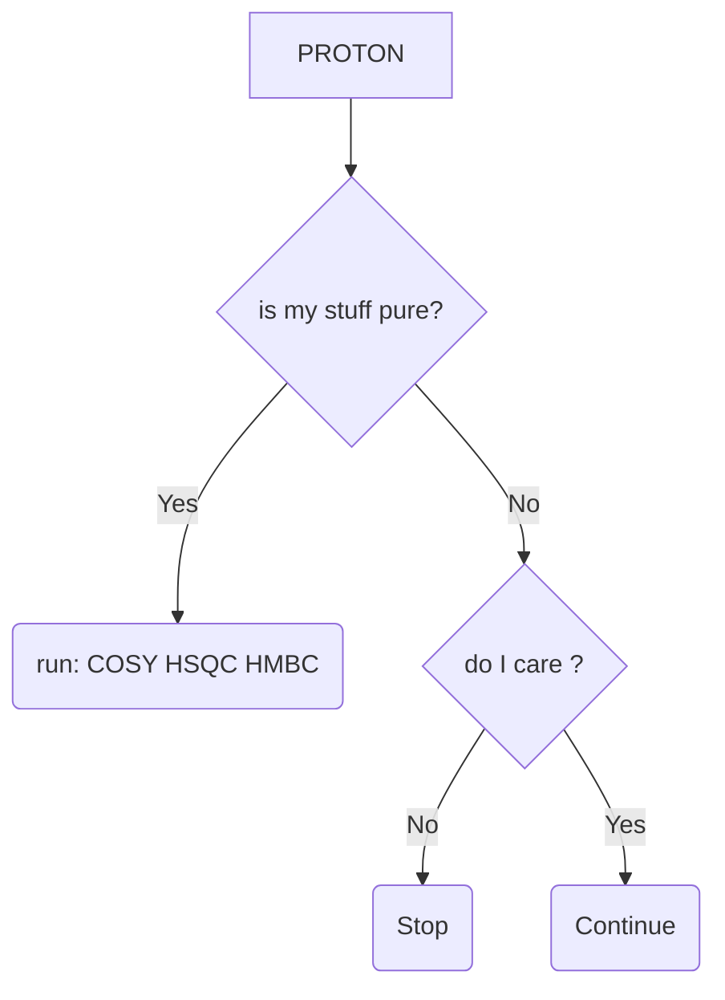
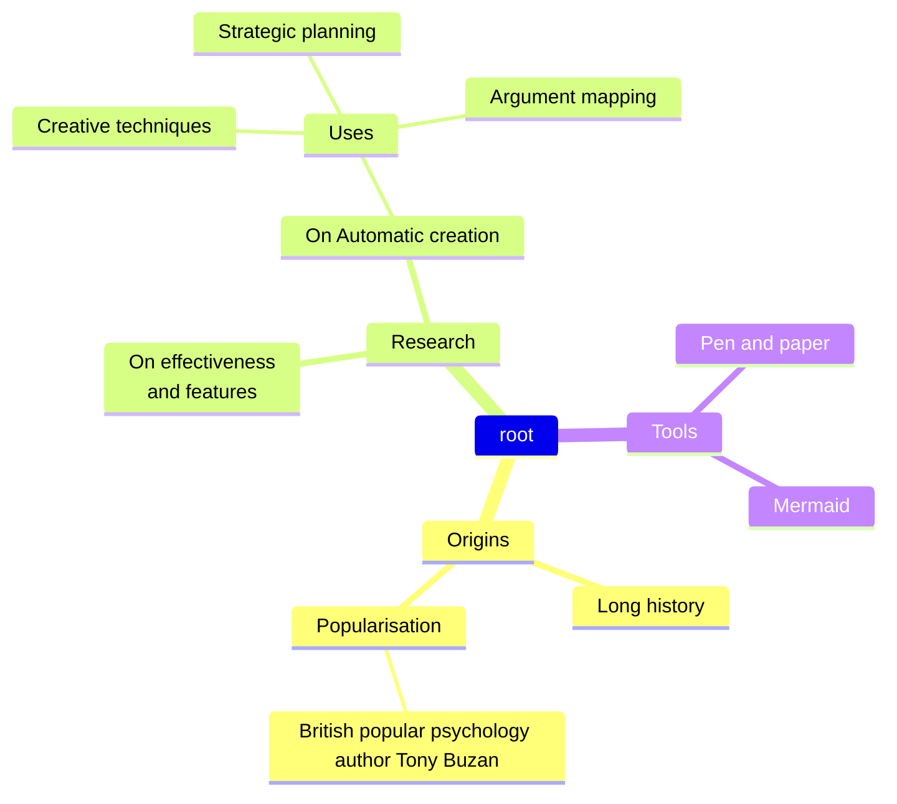

Here are notes explaining how to perform certain tasks:
- $He$ fill
- $N_2$ fill
- 
type in Topspin's command line bar: iconnnmr

- 
this is the explanation
 

The three following don't render or even trigger an error in hugo, but render correctly in vsvode
```markmap {height="200px"}
- Hugo Modules
  - wowchemy
  - wowchemy-plugins-netlify
  - wowchemy-plugins-netlify-cms
  - wowchemy-plugins-reveal
```

```markmap
- Hugo Modules
  - wowchemy
  - wowchemy-plugins-netlify
  - wowchemy-plugins-netlify-cms
  - wowchemy-plugins-reveal
```


